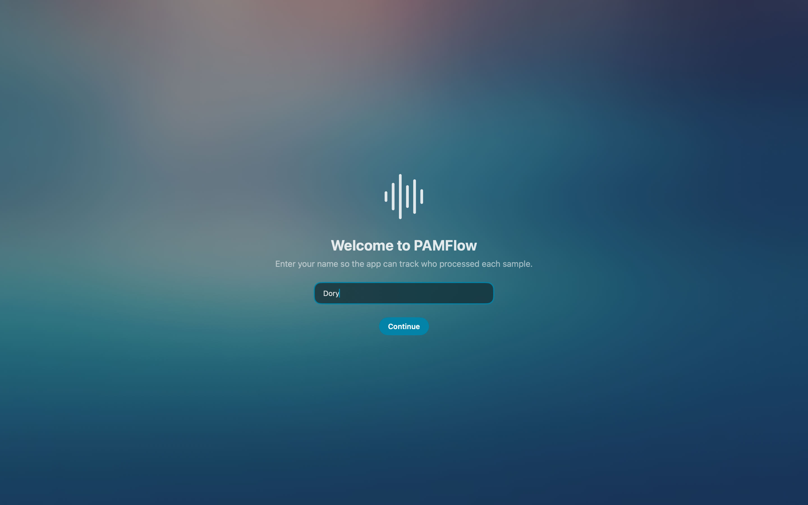
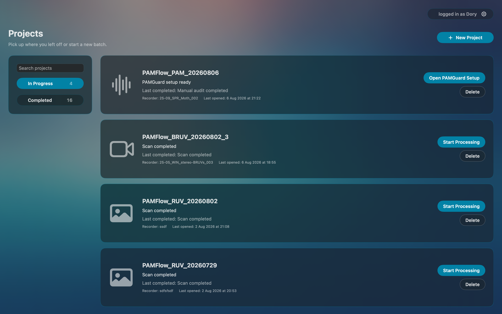
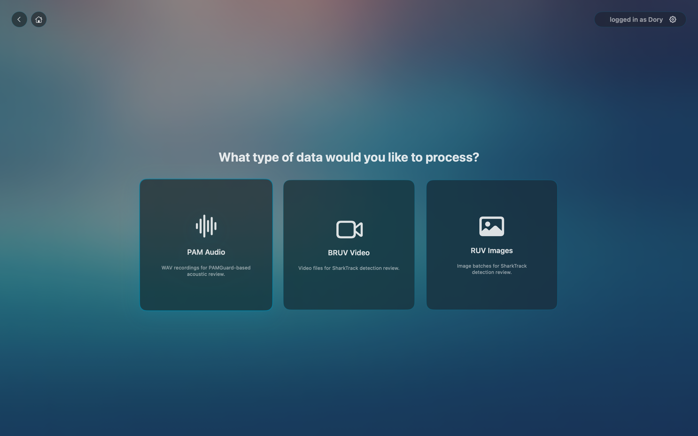
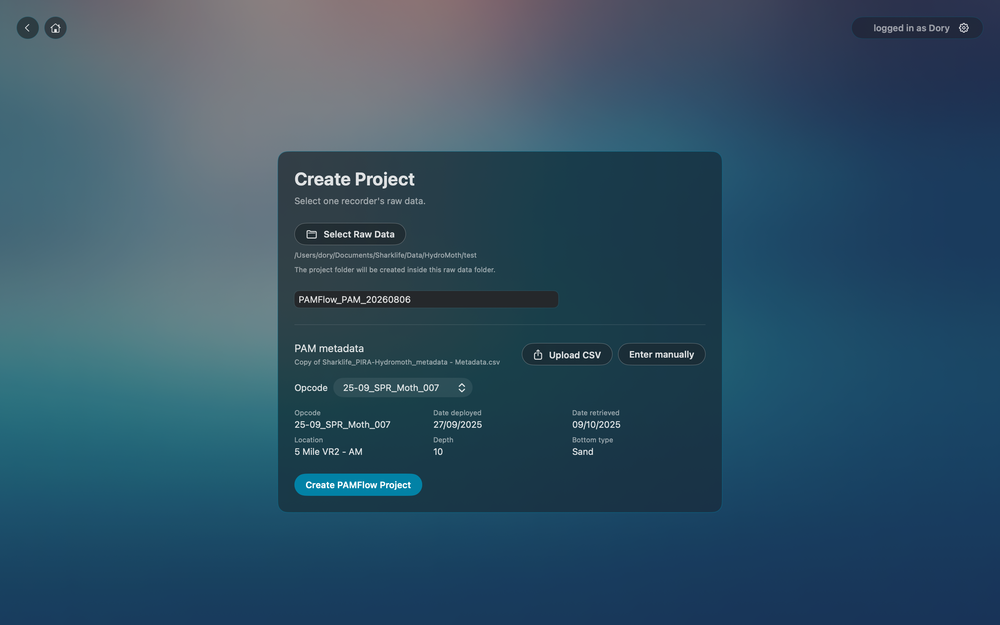
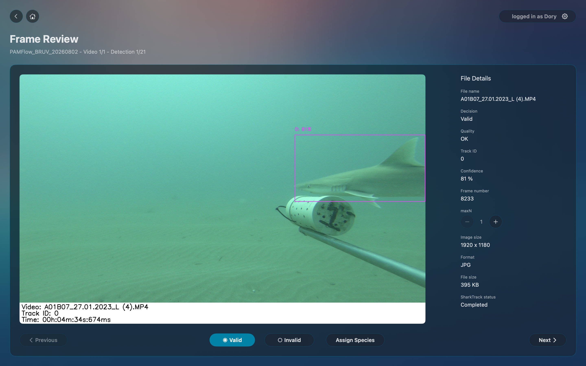
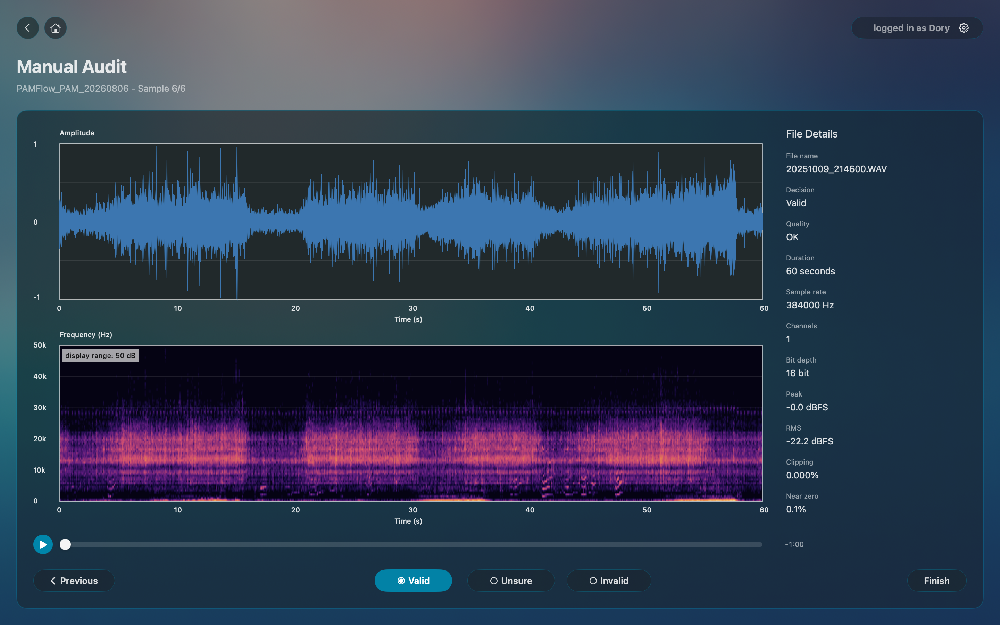
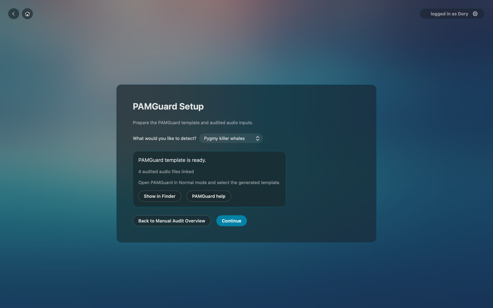
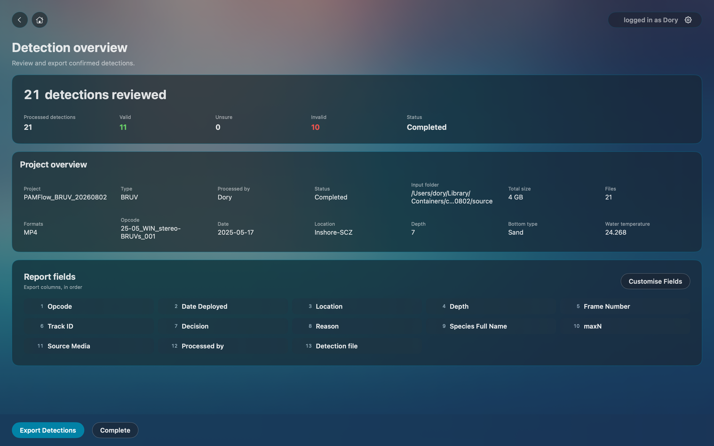

# PAMFlow

PAMFlow is a macOS app for preparing, reviewing, and exporting marine survey detections from PAM audio, BRUV video, and RUV image projects.

It is built for field and lab workflows where raw media may be large, stored on external drives, and reviewed in stages. PAMFlow keeps project progress and review decisions persistent, while storing media-derived project files beside the selected raw data whenever possible.

BRUV and RUV detection processing is powered by SharkTrack, an open-source computer vision workflow for shark and ray detection in underwater imagery. PAMFlow integrates SharkTrack through the [dorypiacek/SharkTrackKit](https://github.com/dorypiacek/SharkTrackKit) Swift wrapper and builds on the original project, [filippovarini/sharktrack](https://github.com/filippovarini/sharktrack).

## Features

- Create structured projects for PAM, BRUV, and RUV workflows.
- Scan selected raw media, show a project overview before review starts.
- Run SharkTrack processing for BRUV and RUV projects.
- Support frame-by-frame review of BRUV/RUV detections.
- Support PAM sample quality audit before PAMGuard processing.
- Prepare PAMGuard input folders and templates for acoustic detection workflows.
- Import and group PAMGuard detections into reviewable events.
- Export reviewed detections and supporting files for downstream analysis.

## Supported Workflows

### PAM Audio

PAM projects are designed for passive acoustic monitoring workflows using [PAMGuard](https://www.pamguard.org/).

1. Select PAM audio data.
2. Review the scan overview.
3. Optionally audit sample quality.
4. Prepare PAMGuard inputs and open the generated PAMGuard template.
5. Run PAMGuard externally.
6. Return to PAMFlow to import and review grouped detection events.
7. Export the final detection package.

The PAM export package can include CSV tables, reviewed samples, spectrogram images, and Raven selection tables.

### BRUV Video

BRUV projects use SharkTrack to find candidate animals in underwater video.

1. Select BRUV video data.
2. Review the scan overview.
3. Run SharkTrack processing.
4. Review detected frames.
5. Mark detections as valid or invalid.
6. Assign species and maxN where needed.
7. Export the reviewed detections.

### RUV Images

RUV projects follow the same review and export structure as BRUV, but operate on still images rather than video.

## Using PAMFlow

### Welcome

On first launch, PAMFlow asks for your name. This name is used as the reviewer or processed-by value in exported files. Completed projects keep the reviewer name they were completed with, even if the active user name changes later.



### Projects

The Projects screen is the starting point after setup. It shows in-progress and completed projects, and lets you reopen work where you left off.

Projects can be searched by name, recorder, status, and saved source paths. If a project folder or external drive is unavailable, PAMFlow still shows saved project details and review decisions where possible.



### New Project

To start a project, choose the data type:

- PAM audio
- BRUV video
- RUV image



Then select the raw media folder or files and enter the project metadata. PAMFlow creates the project folder beside the selected raw data whenever it has permission to do so.



### Metadata

Metadata connects detections to deployment details such as opcode, date, location, depth, bottom type, and water temperature.

Metadata can be entered manually or loaded from a CSV table. When a metadata CSV is uploaded, PAMFlow can reuse it for future projects of the same type.

### Scan Overview

After project creation, PAMFlow scans the selected media and shows a summary before review starts. Use this overview to confirm that file counts, formats, durations, sample rates, frame rates, and metadata look correct.

### SharkTrack Processing

BRUV and RUV workflows use SharkTrack to identify candidate detections before human review. PAMFlow shows processing progress and then opens Frame Review when detections are ready.

No detections is a valid result. PAMFlow treats that as a completed processing outcome rather than an app failure.

### Frame Review

Frame Review is used for BRUV and RUV detections. The reviewer confirms whether each SharkTrack candidate should be kept.

- Mark detections Valid when the frame contains a useful animal detection.
- Mark detections Invalid when the candidate should not be kept.
- Assign species for valid detections when known.
- Check and adjust maxN when needed.



### PAM Manual Audit

PAM Manual Audit is a sample quality check before PAMGuard. It is not a species detection task.

Use it to confirm whether each sample is suitable for PAMGuard processing:

- Valid: usable underwater recording.
- Unsure: questionable quality.
- Invalid: corrupted, noisy, or unsuitable recording.



### PAMGuard Setup

For PAM projects, PAMFlow prepares a PAMGuard folder with reviewed audio inputs, database and binary folders, and a generated PAMGuard template.

Open PAMGuard in Normal mode, select the generated template, run detections, then return to PAMFlow when PAMGuard finishes.



### Completion and Export

The completion screen summarises review decisions and exports the final results.

For BRUV and RUV, exports include reviewed detection records and selected fields such as detection file, source media, species, maxN, and processed-by.

For PAM, exports can include sample and event tables, reviewed WAV samples, spectrogram images, and Raven selection tables.



## Project Storage

PAMFlow stores essential project state in the app database so progress can be resumed after closing the app. Large generated resources stay in the project folder instead of being copied into app storage.

Project folders are created beside the selected raw data whenever possible. If the app cannot write there, it asks for a writable location.

Project scanning is implemented natively in the macOS app. PAMFlow does not require a separate Python scanner for PAM, BRUV, or RUV project scans.

## Species Taxonomy

PAMFlow uses a bundled offline taxonomy file at `App/Resources/species.json` for species assignment. The app does not call WoRMS at runtime and does not import taxonomy records into SwiftData.

Each taxonomy record contains:

- stable WoRMS AphiaID as `id`
- scientific name
- genus
- family
- common English name when available
- taxon group

Review decisions store only the selected `speciesID` plus denormalized display strings for export and backwards compatibility. Species details are resolved through the in-memory taxonomy service when the UI needs to show them.

### Downloading From WoRMS

Download before the first run and refresh the bundled taxonomy manually when needed:

```bash
scripts/update_species_taxonomy.py
```

To fetch a custom set of WoRMS clades without editing the script, pass `--taxon GROUP:NAME` one or more times:

```bash
scripts/update_species_taxonomy.py \
  --taxon elasmobranch:Elasmobranchii \
  --taxon odontocete:Odontoceti
```

## Requirements

- macOS on Apple Silicon
- PAMGuard for PAM detection workflows
- Xcode for development builds
- `uv` for preparing the SharkTrackKit development runtime

## Building From Source

Install PAMFlow's Swift package dependencies in Xcode, including `SharkTrackKit`.

Before running BRUV or RUV detections from a development build, prepare the SharkTrackKit runtime. Do not install the runtime into Xcode's SwiftPM checkout: Xcode stores package sources in DerivedData, and command-line SwiftPM stores them under `.build/checkouts`. Those locations are build caches, not stable developer-managed install locations.

Install the runtime once with SharkTrackKit's installer:

```bash
git clone https://github.com/dorypiacek/SharkTrackKit.git ../SharkTrackKit
../SharkTrackKit/scripts/install_runtime.sh
```

The first setup is large and may take time. It creates an isolated runtime at:

```text
~/Library/Application Support/SharkTrackKit/runtimes/<runtime-version>/
```

The installer does not use `sudo`, install global Python packages, or modify system Python.

### SharkTrack And App Sandbox

The external development runtime is a local developer tool. A sandboxed macOS app cannot freely read and execute a Python virtual environment from `~/Library/Application Support`, even when that runtime is installed correctly.

For development, PAMFlow's Debug build runs without App Sandbox so Xcode can launch SharkTrackKit against the installed development runtime. Release builds should stay sandboxed and use the frozen, signed runtime bundled into the app by the release packaging workflow.

Do not use the external development runtime as the end-user distribution model for a sandboxed app.

PAMFlow can build without the development runtime, but SharkTrack processing will stop at the detection screen and show the SharkTrackKit setup error if the runtime is missing, incomplete, incompatible, or broken.

For CI/tests only, set `SHARKTRACKKIT_HOME` to override the base install directory.

Open `PAMFlow.xcodeproj` in Xcode and build the `PAMFlow` scheme.

Command-line build:

```bash
xcodebuild -project PAMFlow.xcodeproj -scheme PAMFlow -configuration Debug -destination 'platform=macOS' build
```

## Optional Packaging

Create a local drag-to-Applications DMG:

```bash
scripts/create_dmg.sh
```

If Xcode has already built the app, package an existing app:

```bash
APP_PATH="/path/to/PAMFlow.app" SKIP_BUILD=1 scripts/create_dmg.sh
```

For local testing without a Developer ID certificate:

```bash
ALLOW_ADHOC_SIGNING=1 APP_PATH="/path/to/PAMFlow.app" SKIP_BUILD=1 scripts/create_dmg.sh
```

Ad-hoc builds are for local testing only. Developers preparing their own builds should sign them with their own Apple Developer identity.

To create and push the GitHub release tag for the current app version:

```bash
scripts/push_release_tag.sh
```

To create the DMG and push the current version tag after the DMG succeeds:

```bash
PUSH_VERSION_TAG=1 scripts/create_dmg.sh
```

Local packaging defaults to `PACKAGE_CONTEXT=local`, so it does not push tags unless `PUSH_VERSION_TAG=1` is set. GitHub Actions release packaging runs with `PACKAGE_CONTEXT=github`; manual release runs push the current version tag automatically, while tag-triggered release runs use the tag that started the workflow.

## Installing GitHub Release Builds

Initial GitHub release builds are distributed as unnotarized macOS DMGs. macOS may warn that it cannot verify the developer or check the app for malicious software.

To open an unnotarized build, drag PAMFlow to Applications and try opening it once. If macOS blocks it, open System Settings, go to Privacy & Security, scroll to the Security section, and click Open Anyway for PAMFlow. Confirm Open in the macOS security prompt. Only install builds downloaded from the official GitHub Releases page.

These builds bundle SharkTrack inside the app. They do not require a separate SharkTrackKit runtime install.

## Planned Features

- Improved long-running processing resume support.
- Improved maxN calculation for BRUV/RUV frames.
- Google Sheets integration for metadata lookup and export delivery.
- Additional export presets.
- More project types and review workflows.

## Contributing

Contributions are welcome.

Before opening a pull request:

1. Build the app from a clean checkout.
2. Test the affected workflow manually.
3. Keep user-facing copy clear and non-technical.
4. Preserve project data and avoid destructive behavior without confirmation.
5. Include screenshots or screen recordings for UI changes when helpful.

Please open an issue first for larger workflow changes so the project direction can be discussed before implementation.

## License

PAMFlow is available under the [MIT License](https://opensource.org/license/mit). It integrates third-party software, including SharkTrack, which remains subject to its original copyright notices and licence terms.
